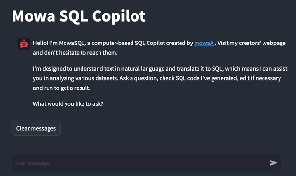
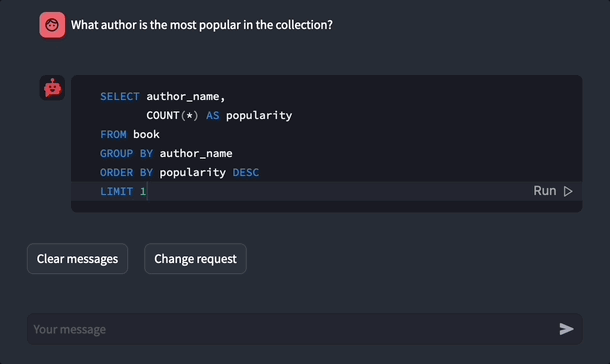
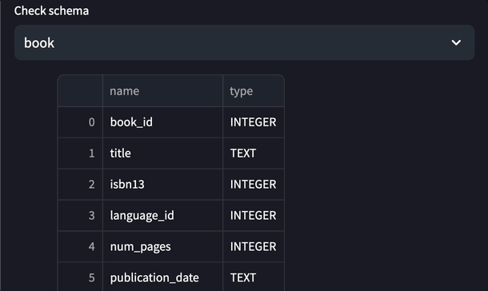
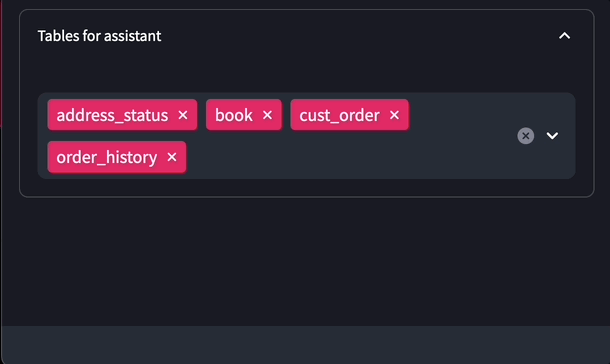

# :robot: SQL-Copilot
Your personal SQL Copilot created by [mowaAI](https://www.mowa.ai/). Query your SQLite database with Natural Language.

<!-- Add buttons here -->
[](https://opensource.org/licenses/Apache-2.0) []()


## Table of contents
  - [Table of contents](#table-of-contents)
  - [Usage](#usage)
  - [Installation and running](#installation-and-running)


## Usage
###### :question: Ask questions in Natural Language, Mowa Copilot will write an SQL for you.


###### :memo: Edit SQL before execution if needed.


###### :eyes: Preview database structure.


###### :joystick: Control which tables are seen by the Copilot.



## Installation and running
1. Put your `*.db` dataset to folder data and change `PATH_TO_DATA` in a Dockerfile. By default it's set to `bookstore_v4.db` dataset.
2. Run `bash setup.sh` to build a Docker with application.
3. After the previous command is finished run the following command to run a container. Replace `your-openai-key` with your OpenAI access token.
    ```docker run -p 8081:8081 -e OPENAI_API_KEY="your-openai-key" sql-copilot```
4. Service must be up and running.